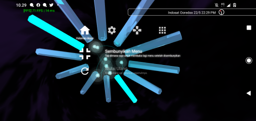

# OSDBKG
Wallpaper hidup, berdasarkan Latar Belakang PlayStation 2, untuk Android dan Live Wallpaper.

### Tangkapan Layar

## Kebutuhan Sistem
### Android
- Android 4.4 KitKat
- 1GB RAM
- 1.28 GHz ARMv7 CPU
- Mendukung OpenGL ES 3.0
- 2MB Penyimpanan tersedia
  - Versi Android yang lebih baru akan menggagalkan pemasangan jika penyimpanan hanya tersisa 500MB-200MB

### Windows
- Windows 7 atau yang lebih baru
- 32MB RAM Bebas ( 128MB Direkomendasikan )
- 1.28 GHz x86 CPU ( 2.0GHz Direkomendasikan )
- OpenGL 3.3
- 1MB Penyimpanan tersedia
- Wallpaper Engine (atau yang mendukung penanaman aplikasi Unity)

## Building
### Bahan
- Git
- CMake 3.8 atau yang lebih baru
- .NET Scripting Tool
- Android : 
  - Android SDK 31 & NDK 23
  - Android Studio (Opsional, tapi Direkomendasikan)
- Desktop :
  - Punya pustaka pengembangan untuk OpenGL, GLFW, GLEW dan Zlib.

### Langkah
#### Desktop
- Clone repositori ini
- Jalankan CMake dengan input direktori diisi dengan direktori akar projek
- Jalankan alat build (GNU Makefile, MSBuild)

#### Android (Android Studio)
- Clone repositori ini
- Buka Projek Android Studio (di "(project root)/android")
- Build

## Masalah yang diketahui
#### Tidak ada ikon aplikasi di Android, cara pakainya?
Di projek ini, Aplikasi Android yang dibuild hanya berisi satu wallpaper dan satu aktifitas tes, Cara
pakai wallpaper nya ya dengan masuk ke `Pengaturan > Tampilan > Wallpaper > Wallpaper Animasi`.

Aktifitas tes hanya bisa dijalankan via Android Studio, ADB atau lewat aplikasi yang bisa mengakses semua
aktifitas di sebuah aplikasi seperti [LonelyCatGames' X-plore](https://play.google.com/store/apps/details?id=com.lonelycatgames.Xplore&hl=in&gl=US)

#### Gak sama!
Loh loh loh gak gitu, Pikir aja aplikasi ini hanya sebagai pembuatan ulang yang asal-asalan. Gak ada niat buat bikin
ini se-sama mungkin, emang dari awal emang rencananya dibuat simpel dan asal mirip doang.

#### Pembiasan di kristal tidak akurat
Saya punya masalah dalam Matematika ya, Sebenarnya masalah ini ada di algoritma kalkulasi penghasil
koordinat tekstur terbias di dalam shader yang kode nya saya buat. Kalau ada yang mau bantu mah, tolong ya~ 🙂.

#### Pantulan kristal nya nge-glitch.
Ini terjadi karena balapan kondisi, dimana data tekstur ditulis dan dibaca pada waktu yang hampir bersamaan,
dalam kasus ini untuk membuat efek pembiasan. Di versi desktop, harusnya tidak masalah karena saya sudah
memasukkan pembatas memori tekstur pada hampir semua draw call untuk meminimalisir efek ini. tapi masalahnya
yang di Android, OpenGL ES tidak memiliki fungsi pembatas memori tekstur dalam spesifikasi nya dan tidak
banyak perangkat mengimplementasikannya sebagai ekstensi.

Silahkan cek kalau perangkat anda mendukung ekstensi `GL_NV_texture_barrier`, Jika iya maka kemungkinan besar
ini tidak akan terjadi di perangkat anda. atau kadang perangkat terlalu bagus dalam hal manajemen memori grafis 
atau terlalu cepat menangani draw call sehingga glitch ini tidak akan terjadi tanpa adanya ekstensi pembatas 
memori tekstur.

#### Kode mu gak konsisten, jelek banget ah!
Ya mohon maaf, saya pelupa dan pemalas akut, saya sering melupakan gaya koding saya sebelumnya
dan kalau bikin kesalahan koding suka males negbersihinnya. Tapi yang paling penting aplikasi nya 
jadi kan ya?

## License
CC0 Public Domain, please refer to [Legal Code](https://creativecommons.org/publicdomain/zero/1.0/legalcode)