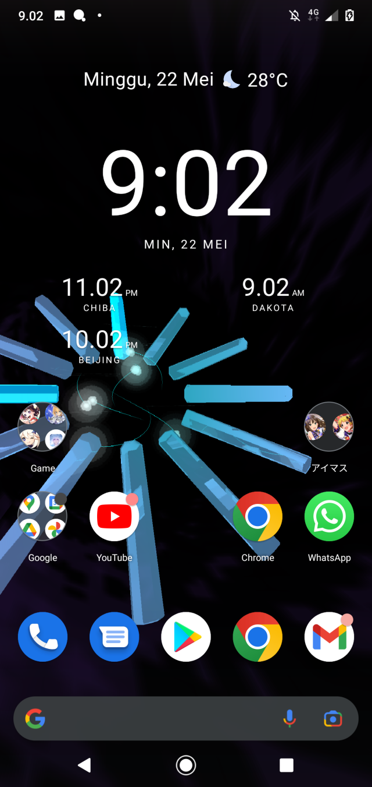
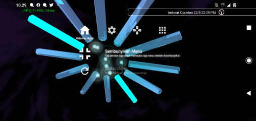

English | [Bahasa Indonesia](README.ID.MD)
# OSDBKG
PlayStation 2 Background-like Live Wallpaper, Compatible with Android and Wallpaper Engine.

### Screenshots

## System Requirements
### Android
- Android 4.4 KitKat
- 1GB RAM
- 1.28 GHz ARMv7 CPU
- Supports OpenGL ES 3.0
- 2MB Free Internal Storage Space
  - Newer Android version will fail the installation if device have less than 500MB-200MB storage space.

### Windows
- Windows 7 or later
- 32MB Free RAM ( 128MB Recommended )
- 1.28 GHz x86 CPU ( 2.0GHz Recommended )
- OpenGL 3.3
- 1MB Free Storage Space
- Wallpaper Engine (or any that supports Unity app embedding)

## Building
### Pre-requisites
- Git
- CMake 3.8 or newer
- .NET Scripting Tool
- Android : 
  - Android SDK 31 & NDK 23
  - Android Studio (Optional, but Recommended)
- Desktop :
  - Have OpenGL, GLFW, GLEW and Zlib development library installed

### Steps
#### Desktop
- Clone the repo
- Configure the project by running CMake with the project root as argument
- Run the build tool (GNU Makefile, MSBuild)

#### Android (Android Studio)
- Open the Android Studio Project (at the "(project root)/android")
- Build

## Known Problems
#### I cannot launch this application on Android
The built Android app only contains one Live Wallpaper and one Testing activity, The only way to open
the Live Wallpaper is to actually go to your device `Settings > Display > Wallpaper > Live Wallpapers`.

The test activity only launchable via Android Studio and some application that reveals every
activity in an application like [LonelyCatGames' X-plore](https://play.google.com/store/apps/details?id=com.lonelycatgames.Xplore&hl=in&gl=US)

#### This is not 1:1 to PS2's Background!
First and foremost, Think it as a mediocre recreation / demo. I do not plan to make it 1:1 to PS2's
original background, I just want to make something similar but simpler.

#### The crystal refraction is not accurate!
I have some problem with math, This is actually something to do with the refracted texture coordinate
calculation in the shader. if someone can help with it, then please 🙂.

#### The crystal have glitchy refractions.
It's appears due to a race condition, where a texture data is written and read at nearly the same
time, in this case is to create the refraction effect. On desktop, it should be fine
since I've put texture memory barrier on almost every draw call to minimize this effect, but on Android,
the effect will be hugely varies by what I've said before since OpenGL ES didn't have the texture memory
barrier functionality in the specs and not much driver implements it as an extension,

Go check if your phone have `GL_NV_texture_barrier` extension, if it's there then most likely it
wouldn't happen to your phone. or sometimes the phone just too good at graphical memory management or
do draw calls too fast that this glitch wouldn't happen even without the texture memory barrier extension.

#### Your code is ugly and inconsistent
Actually, I myself have a memory and laziness problem, so sometime I can forget
something and messed up what I've worked before and just too lazy to clean the coding convention mess
I've wrote. But, as long as it works, it should be fine, right?

## License
CC0 Public Domain, please refer to [Legal Code](https://creativecommons.org/publicdomain/zero/1.0/legalcode)